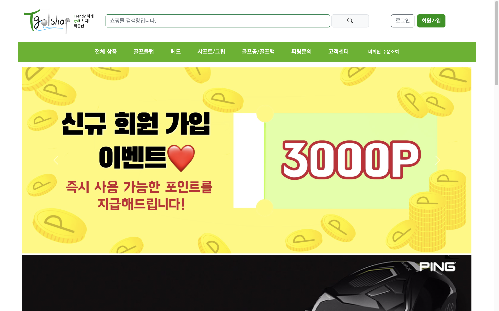

# 골프 용품 쇼핑몰

실제 운영 중인 골프 용품 매장에서 이용하고 있는 쇼핑몰 사이트입니다.

URL: <https://www.tgolshop.co.kr>

Continuous Deployment: <https://github.com/dinoWebApp/continuous-deploy-docker>

## 사용한 메인 라이브러리

- 프론트엔드
  - vue v3.2.13
  - bootstrap v5.2.3
  - axios v1.2.6

- 백엔드
    - express v4.18.2
    - express-session v1.17.3
    - passport v0.6.0
    - passport-local v1.0.0
    - mongodb v4.13.0
    - cors v2.8.5
    - bcryptjs v2.4.3

## 배포 및 아키텍처

- 리눅스에 nginx 웹서버 구축
- 도커라이징하여 웹서버를 통해 배포
- 외부 DB(MongoDB Atlas)와 이미지 호스팅 서비스(Cloudinary) 사용
- Github Actions 와 DockerHub Webhooks를 사용하여 빌드/배포 자동화 파이프라인 구축

## 메인 화면

- 카테고리별, 브랜드별 상품 목록을 최신 상품 순으로 나열합니다.
- 회원에 한에서 피팅 문의 작성이 가능합니다.
- 고객센터에서 매장 정보, 배송, 환불, 수리 규정, 무통장 입금 계좌, 비회원 문의 확인이 가능합니다.
- 비회원 주문 조회가 가능합니다.
- 이벤트 배너
- 골프 클럽 광고배너
- 전체 상품 중 댓글 개수 상위 6개 상품을 불러온 뒤 추천 상품으로 개시합니다.

## Authentication

- id, pw를 이용한 인증 기능을 구현하였습니다.

## Authorization

- session을 기반으로 권한을 부여합니다.

## 마이페이지

- 로그인이 되어 있지 않다면 로그인 페이지로 이동합니다.
- 주문 목록에서 배송 상태를 확인할 수 있습니다.
- 장바구니 관리, 장바구니 담은 상품 구매 기능을 구현였습니다.
- 상품 후기, 개인 문의을 작성할 수 있습니다.
- 포인트 조회, 개인 정보 수정이 가능합니다.

## 상품 상세 페이지
- 상품 정보, 상품 후기를 확인할 수 있습니다.
- 관련 상품 목록에는 같은 카테고리별 상품을 댓글 개수 순으로 나열하여 개시합니다.
- 상품 문의 작성이 가능합니다.
- 옵션과 수량을 선택하여 장바구니에 담거나 결제가 가능합니다.

## 관리자 페이지
- 회원 정보를 조회할 수 있습니다.
- 상품 등록, 수정, 삭제가 가능합니다.
- 주문 관리를 통해 주문 취소, 배송 상태 수정, 운송장 번호 등록이 가능합니다.
- 상품 문의, 개인 문의, 피팅 문의, 비회원 문의에 대한 응답, 관리가 가능합니다.

